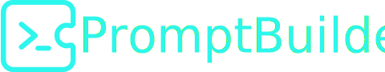

<p align="center">
  
</p>

<h1 align="center">Prompt Builder</h1>

<p align="center">
  An intelligent web application that transforms simple descriptions into structured, model-specific prompts for various AI image and video generators.
</p>

<p align="center">
  
  
  
  
</p>

## ✨ Introduction

Prompt Builder is an advanced tool designed for AI art enthusiasts, developers, and prompt engineers. It bridges the gap between a simple idea and a high-quality, perfectly formatted prompt, saving you time and maximizing the potential of generative AI models. The application intelligently manages complex syntax, model-specific parameters, and content rules, allowing you to focus on creativity.

**[➡️ Live Demo Placeholder](https://your-live-demo-url.com)**


## 🚀 Key Features

*   **🧠 Intelligent Prompt Generation:** Utilizes a powerful LLM (via your API key) to expand simple descriptions into multiple detailed prompt variations.
*   **🤖 Model-Specific Optimization:** Automatically formats prompts for a wide range of popular AI models, including tag-based (Stable Diffusion), natural language (Google Imagen), MidJourney, and video models.
*   **🖥️ Desktop Application:** Native Windows desktop app with Electron for quick access without browser overhead.
*   **🏠 Local LLM Support:** Connect to local AI models (Ollama, Mistral, etc.) for complete privacy and offline usage.
*   **🔧 Advanced Controls:** Fine-tune every aspect with settings for negative prompts, aspect ratios, seeds, and custom parameters.
*   **🎨 High-Level Directives:** Use intuitive controls for Style (Realistic/Anime), Character attributes (age, gender, ethnicity, etc.), and Content Rules (SFW/NSFW).
*   **⚡️ Workflow Accelerators:**
    *   **Presets:** Quickly add popular terms for shots, poses, locations, and clothing.
    *   **Snippets:** Save and reuse your favorite phrases or complex character descriptions.
    *   **Enhance & Randomize:** Use AI to enrich your existing idea or generate a new one from scratch based on your settings.
*   **⚖️ Prompt Weighting:** Easily increase `(word:1.1)` or decrease `[word]` the importance of selected text.
*   **🖼️ Integrated Image Generation:** Send a finished prompt directly to the built-in image generator (supports Google Imagen).
*   **🔐 Secure & Private:** Your API keys are stored exclusively in your browser's local storage and are never sent to any server.
*   **💾 Import/Export:** Save your entire workspace setup to a JSON file for backup or to share with others.

## 🏁 Getting Started

### Prerequisites

You'll need an API key from a supported Language Model (LLM) provider. This application uses an LLM to understand your intent and generate the structured prompts. Google Gemini (`gemini-2.5-flash`) is recommended.

### Usage

1.  **Open the App:** Navigate to the live demo URL.
2.  **Set Your API Key:**
    *   Expand the **API Settings** section.
    *   Select your LLM provider (e.g., Google Gemini).
    *   Paste your API key into the input field. The app is now ready to use.
3.  **Describe Your Idea:** Type a basic concept into the main text box (e.g., "a knight in a forest").
4.  **Choose Your Target Model:** Select the image/video generation AI model you will be using (e.g., `SDXL`, `Google Imagen4`).
5.  **Generate:** Click the **Generate Prompt** button and see the results!

## 🖥️ Windows Desktop Application

### Download & Installation

**Portable Version (Recommended):**
1. Download the latest release from the [Releases](https://github.com/btitkin/promptbuilder/releases) page
2. Extract the ZIP file to your desired location
3. Navigate to the `portable-app` folder
4. Double-click `start.bat` to launch the application

**No installation required!** The portable version includes everything needed to run.

### Building from Source

```bash
# Clone the repository
git clone https://github.com/btitkin/promptbuilder.git
cd promptbuilder

# Switch to the local LLM branch
git checkout local_llm_version

# Install dependencies
npm install

# Build for Electron
$env:ELECTRON='true'; npm run build

# Run the desktop app
npm run electron

# Or build executable
npm run dist
```

## 🏠 Local LLM Integration

### Supported Local Models

- **Ollama** (Recommended)
- **Mistral** 
- **LM Studio**
- **Any OpenAI-compatible API**

### Setup Instructions

#### Using Ollama

1. **Install Ollama:** Download from [ollama.ai](https://ollama.ai)
2. **Pull a model:**
   ```bash
   ollama pull mistral
   # or
   ollama pull llama2
   ```
3. **Start Ollama server:**
   ```bash
   ollama serve
   ```
4. **Configure in Prompt Builder:**
   - Open API Settings
   - Select "Custom/Local API"
   - Set API Base URL: `http://localhost:11434`
   - Set Model Name: `mistral` (or your chosen model)
   - Leave API Key empty (optional for local)

#### Using Other Local APIs

1. **Start your local LLM server** (ensure it's OpenAI-compatible)
2. **Configure in Prompt Builder:**
   - API Base URL: Your server URL (e.g., `http://localhost:1234`)
   - Model Name: Your model identifier
   - API Key: If required by your setup

### Benefits of Local LLMs

- **🔒 Complete Privacy:** Your data never leaves your computer
- **⚡ No Rate Limits:** Generate as many prompts as you want
- **💰 Cost-Free:** No API costs after initial setup
- **🌐 Offline Usage:** Works without internet connection
- **🎛️ Full Control:** Choose your preferred model and settings

## 🤖 Supported Models

Prompt Builder can generate optimized prompts for the following models:

| Text-to-Image (Natural Language) | Text-to-Image (Tags) | MidJourney   | Video Models |
| ----------------------- | ---------------------- | ------------ | ------------ |
| Google Imagen4          | SDXL                   | MidJourney   | Veo 3        |
| Flux                    | Pony                   |              | SVD          |
| OpenAI (DALL-E)         | Stable Cascade         |              | CogVideoX    |
| Nano Banana             | SD 1.5                 |              | Hunyuan Video|
| Qwen                    | Illustrious            |              | LTXV         |
|                         | ...and more            |              | Wan Video    |


## 🛠️ Tech Stack

*   **Framework:** React 19
*   **Language:** TypeScript
*   **Styling:** Tailwind CSS
*   **Desktop:** Electron (Windows/Mac/Linux)
*   **AI Integration:** 
    *   Google Gemini API via `@google/genai`
    *   Custom/Local LLM support (Ollama, Mistral, etc.)
    *   OpenAI-compatible API endpoints
*   **Build Tools:** Vite, electron-builder

## 🤝 Contributing

Contributions are welcome! Feel free to submit pull requests or open issues for bugs, feature requests, or suggestions.

1.  Fork the repository.
2.  Create your feature branch (`git checkout -b feature/AmazingFeature`).
3.  Commit your changes (`git commit -m 'Add some AmazingFeature'`).
4.  Push to the branch (`git push origin feature/AmazingFeature`).
5.  Open a Pull Request.

## 📄 License

This project is licensed under the MIT License - see the [LICENSE.md](LICENSE.md) file for details.
